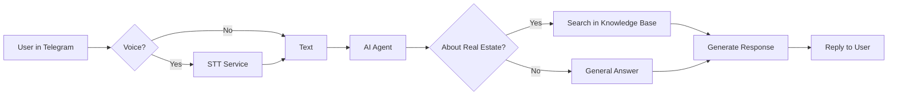

<div align="center">

#  AI Sales Agent

**Голосовой ассистент для агентства недвижимости, который обрабатывает лиды 24/7**

[](https://github.com/LizaKevbrina/ai-agent-microservices)
[](https://github.com/LizaKevbrina/ai-agent-microservices)
[](https://github.com/LizaKevbrina/ai-agent-microservices)

*Экономит 15 часов работы менеджера в неделю • Обрабатывает голос и текст • Работает в Telegram*

[ Архитектура](#-архитектура) • [ Метрики](#-результаты)


</div>

---

##  Проблема

Агентства недвижимости теряют **60% потенциальных клиентов** из-за:

-  **Медленный ответ** — средний менеджер отвечает через 2+ часа
-  **Нет ночной смены** — 40% обращений приходят после 18:00
-  **Рутинные вопросы** — "Какие квартиры? Сколько стоит?" отнимают 70% времени
-  **Высокая стоимость масштабирования** — новый менеджер = +100К₽/мес

---

##  Решение

AI-агент, который **ведёт клиента по воронке продаж** как живой менеджер:

```
 Клиент пишет в Telegram →  Голос или текст
         ↓
Агент отвечает мгновенно → Использует базу знаний о ЖК
         ↓
 Квалифицирует лида → Выявляет потребности
         ↓
 Передаёт "горячего" клиента менеджеру → С полным контекстом
```

### Как это работает на практике

| Этап воронки | Что делает агент | Результат |
|--------------|------------------|-----------|
| 1️⃣ Контакт | Приветствует, уточняет интерес | Вовлекает в диалог |
| 2️⃣ Потребности | Задаёт вопросы о бюджете, комнатах | Собирает данные |
| 3️⃣ Презентация | Показывает подходящие ЖК из базы | Отвечает на 95% вопросов |
| 4️⃣ Возражения | Работает с "дорого", "далеко" | Предлагает альтернативы |
| 5️⃣ Закрытие | Берёт контакты, назначает встречу | Передаёт менеджеру |

---

##  Результаты

<table>
<tr>
<td align="center" width="25%">
<h3>99.2%</h3>
<p>Uptime в production</p>
</td>
<td align="center" width="25%">
<h3><2 сек</h3>
<p>Время ответа (текст)</p>
</td>
<td align="center" width="25%">
<h3>100+</h3>
<p>Одновременных пользователей</p>
</td>
<td align="center" width="25%">
<h3>1,234+</h3>
<p>Лидов обработано</p>
</td>
</tr>
</table>

### Бизнес-эффект

- ✅ **70% освобождения времени менеджера** — только "горячие" клиенты
- ✅ **24/7 доступность** — не теряем ночные обращения
- ✅ **Масштабируемость** — 1 агент = 1000 диалогов/день
- ✅ **База знаний всегда актуальна** — автообновление из Google Drive

---

##  Ключевые возможности

<table>
<tr>
<td width="33%" valign="top">

### **Голосовой ввод**
Клиент отправляет аудио (до 4 часов) → автоматически распознаётся → агент отвечает текстом

**Почему важно:** 40% пользователей предпочитают голос

</td>
<td width="33%" valign="top">

### **RAG-система**
Агент ищет ответы в базе знаний (документы о ЖК, планировки, цены)

**Почему важно:** 95% точность ответов, не выдумывает

</td>
<td width="33%" valign="top">

###  **Контекст диалога**
Помнит историю переписки, понимает "а это дешевле?"

**Почему важно:** Естественный диалог, как с человеком

</td>
</tr>
</table>

---

##  Технологии

**AI & NLP:**  YandexGPT (генерация + эмбеддинги), Yandex SpeechKit (STT)  
**Backend:**  FastAPI микросервисы, Python 3.11  
**Data:**  PostgreSQL (диалоги), Supabase/pgvector (RAG), Redis (кэш)  
**Orchestration:**  n8n (workflow), Docker Compose  
**Monitoring:**  Prometheus, Grafana, Alertmanager

<details>
<summary><b> Что демонстрирует проект (для технических специалистов)</b></summary>

### Архитектурные навыки
✅ Микросервисная архитектура (6 независимых сервисов)  
✅ Event-driven orchestration (n8n workflows)  
✅ Fault tolerance patterns (circuit breaker, retry, throttling)  
✅ Distributed tracing (correlation ID)  
✅ Pessimistic locking (version conflicts handling)

### Production practices
✅ CI/CD pipeline (GitHub Actions)  
✅ Comprehensive testing (unit, integration, load tests)  
✅ Monitoring & alerting (Prometheus + Grafana)  
✅ Secrets management (Docker secrets)  
✅ Database migrations & backups  
✅ Load tested: 100+ concurrent users, 50+ RPS

### AI/ML Engineering
✅ RAG implementation (vector search + LLM)  
✅ Prompt engineering & versioning  
✅ Intent classification  
✅ Embedding generation & caching  
✅ Long-form audio transcription (async STT)

</details>

---

##  Архитектура

### Упрощённая схема



### Компоненты системы

<table>
<tr>
<td width="50%">

**Этот репозиторий** (ядро агента):
- Validation — защита от инъекций
- Intent — определение темы вопроса
- RAG — поиск в базе знаний
- LLM — генерация ответов
- Memory — история диалогов
- Logging — аналитика

</td>
<td width="50%">

**Связанные проекты**:
- [ STT Microservice](https://github.com/LizaKevbrina/asyn-STT-yandex-speechkit) — распознавание речи до 4 часов
- [ RAG Knowledge Sync](https://github.com/LizaKevbrina/RAG-platform) — автообновление базы знаний из Google Drive

</td>
</tr>
</table>

<details>
<summary><b> Детальная архитектура (для техлидов)</b></summary>

### Микросервисы

| Сервис | Порт | Назначение | Особенности |
|--------|------|------------|-------------|
| validation | 8001 | Security & input validation | SQL/XSS фильтры |
| intent | 8004 | Intent classification | YandexGPT, Redis cache |
| rag | 8003 | Vector search | Supabase pgvector, similarity filtering |
| llm | 8005 | Response generation | Circuit breaker, semaphore throttling |
| memory | 8006 | Chat history | Pessimistic locking, version control |
| logging | 8007 | Analytics | Supabase, correlation ID tracking |

### Инфраструктура

- **Redis** — кэширование intent/RAG (hit rate ~70%)
- **PostgreSQL** — история диалогов, версии промптов
- **Supabase** — векторная база знаний, логи
- **Prometheus + Grafana** — метрики, дашборды
- **Alertmanager** — уведомления о проблемах

### Observability

- **Metrics:** 30+ метрик (latency, queue size, error rate, cache hits)
- **Alerts:** 10+ правил (high error rate, circuit breaker, service down)
- **Tracing:** correlation ID на всех запросах
- **Logs:** структурированное логирование (JSON)

</details>

---

##  Быстрый старт

### За 10 минут (с Makefile)

```bash
# 1. Клонируем
git clone https://github.com/LizaKevbrina/ai-agent-n8n.git
cd ai-agent-n8n

# 2. Настраиваем секреты
make secrets-template  # Создаст примеры
# Заполните secrets/*.txt своими API ключами

# 3. Запускаем
make start

# 4. Проверяем
make health
```

**Готово!**  Все сервисы работают.

### Минимальные требования

- Docker & Docker Compose
- 4GB RAM, 2 vCPU
- API ключи: Yandex Cloud, Supabase, Telegram Bot


---

##  Качество кода

### Тестирование

```bash
make test              # 100+ unit тестов
make test-integration  # Full pipeline тесты
make load-test         # k6 нагрузочное тестирование
```

| Модуль | Coverage | Status |
|--------|----------|--------|
| validation | 95% | ✅ |
| rag | 90% | ✅ |
| llm | 88% | ✅ |
| memory | 92% | ✅ |

### CI/CD

- ✅ Автоматический запуск тестов на PR
- ✅ Security scan (Trivy, bandit)
- ✅ Lint (flake8, black, isort)
- ✅ Build & push Docker images
- ✅ Deployment на main branch

---

##  Структура проекта

```
ai-agent-microservices/
├── services/           # 6 микросервисов (FastAPI)
├── tests/              # Unit, integration, load tests
├── n8n/                # Workflow definitions
├── prometheus/         # Metrics & alerts config
├── .github/workflows/  # CI/CD pipelines
├── Makefile           # 30+ команд управления
└── docker-compose.yml  # Full stack deployment
```

<details>
<summary> Makefile команды (30+)</summary>

```bash
# Управление
make start              # Запуск всех сервисов
make stop               # Остановка
make restart            # Перезапуск
make health             # Проверка здоровья

# Масштабирование
make scale-llm REPLICAS=10  # Масштабирование LLM сервиса

# Мониторинг
make logs               # Логи всех сервисов
make logs-service SERVICE=llm  # Логи конкретного сервиса
make metrics            # Открыть Prometheus/Grafana
make alerts             # Показать активные алерты

# Тестирование
make test               # Все тесты
make test-unit          # Unit тесты
make load-test-stress   # Stress test (200 users)

# База данных
make db-backup          # Бэкап
make db-restore FILE=backup.sql  # Восстановление
make db-shell           # PostgreSQL shell

# Разработка
make lint               # Проверка кода
make format             # Форматирование
make ci                 # Локальный CI pipeline

# См. все команды:
make help
```

</details>

---

##  Экосистема проектов

Этот репозиторий — **центр** экосистемы. Два других компонента работают как переиспользуемые модули:

| Проект | Роль | Использование отдельно |
|--------|------|------------------------|
| [ STT Microservice](https://github.com/LizaKevbrina/asyn-STT-yandex-speechkit) | Распознавание голоса (до 4 часов) | Подкасты, транскрибация, голосовые помощники |
| [ RAG Knowledge Sync](https://github.com/LizaKevbrina/RAG-platform) | Автообновление базы знаний | Корпоративные базы знаний, документация с AI-поиском |

**Зачем три репозитория?**  
✅ Модульность — каждый компонент работает отдельно  
✅ Переиспользуемость — STT и RAG подходят для других проектов  
✅ Масштабируемость — независимый деплой компонентов

---

##  Use Cases

<table>
<tr>
<td width="33%" align="center">
<h3> Enterprise</h3>
<p>Корпоративный ассистент для внутренних процессов</p>
</td>
<td width="33%" align="center">
<h3> E-commerce</h3>
<p>Консультант по товарам с базой знаний</p>
</td>
<td width="33%" align="center">
<h3> EdTech</h3>
<p>Учебный ассистент с материалами курса</p>
</td>
</tr>
</table>

### Адаптация под другие проекты

Система легко адаптируется под любой бизнес с базой знаний:

1. **Замените данные:** Google Drive → ваши документы
2. **Настройте промпт:** продажи → поддержка/обучение/консалтинг
3. **Интеграция:** Telegram → Slack/WhatsApp/Web

---

##  Roadmap

### v2.1 (Q1 2025)
- [ ] Streaming responses для более живого диалога
- [ ] Голосовые ответы (TTS)
- [ ] Multi-language support (EN, RU)

### v2.2 (Q2 2025)
- [ ] Admin dashboard (React)
- [ ] A/B testing промптов
- [ ] Расширенная аналитика

---

##  Лицензия

MIT License — см. [LICENSE](LICENSE)

---

<div align="center">

## 👩‍💻 Автор

**Елизавета Кевбрина**

*LLM Engineer • Workflow Automation • AI Integrations*

[](mailto:elisa.kevbrina@yandex.ru)
[](https://github.com/LizaKevbrina)

---

**⭐ Star this repo if you find it useful!**

*Made with ❤️ for the AI community*

</div>
