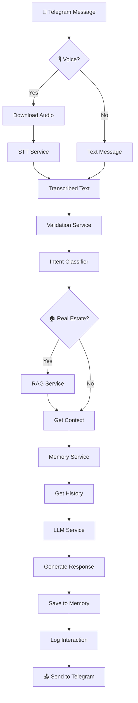

<div align="center">

# AI Sales Agent: Голосовой помощник для продаж недвижимости

[](https://n8n.io)
[](https://fastapi.tiangolo.com)
[](https://cloud.yandex.ru/services/yandexgpt)
[](https://www.docker.com)
[](https://telegram.org)

**Production-ready AI-агент для автоматизации продаж через Telegram**

*Голосовые сообщения → Распознавание речи → RAG по базе знаний → Генерация ответа → Ведение клиента по воронке продаж*

[Архитектура](#-архитектура) • [Быстрый старт](#-быстрый-старт) • [Компоненты](#-компоненты-системы) • [Демо](#-демонстрация)

</div>

---

## 🎯 О проекте

AI Sales Agent — это **production-ready система** для автоматизации продаж недвижимости через Telegram. Агент принимает текстовые и голосовые сообщения, понимает контекст диалога, ищет информацию в базе знаний и ведёт клиента по воронке продаж.

### ✨ Ключевые возможности

| Функция | Описание |
|---------|----------|
|  **Голосовой ввод** | Распознавание аудио до 4 часов через Yandex SpeechKit |
|  **RAG-система** | Семантический поиск по базе знаний о ЖК и квартирах |
| 💬 **Умный диалог** | YandexGPT с историей переписки и контекстом |
| 🎯 **Intent Detection** | Автоматическое определение темы вопроса |
| 📊 **Observability** | Prometheus метрики, distributed tracing, алерты |
|  **Fault Tolerance** | Circuit breaker, retry logic, graceful degradation |

### 🏢 Бизнес-кейс

Агент работает как **AI-менеджер агентства недвижимости **:
- Квалифицирует лиды через Telegram
- Отвечает на вопросы о ЖК, планировках, ценах
- Ведёт клиента по воронке: контакт → потребности → презентация → возражения → закрытие
- Собирает контакты для передачи живому менеджеру

---

##  Архитектура

### Общая схема системы

```
┌─────────────────────────────────────────────────────────────────────────────┐
│                              TELEGRAM USER                                  │
│                         (текст или голосовое сообщение)                     │
└─────────────────────────────────┬───────────────────────────────────────────┘
                                  │
                                  ▼
┌─────────────────────────────────────────────────────────────────────────────┐
│                        ORCHESTRATION LAYER (n8n)                            │
│  ┌────────────────────────────────────────────────────────────────────────┐ │
│  │  Telegram Trigger → Voice Detection → STT (if voice) → Intent Router   │ │
│  │       → RAG Search (if real_estate) → Memory → LLM → Response          │ │
│  └────────────────────────────────────────────────────────────────────────┘ │
└───────────────┬─────────────────┬─────────────────┬─────────────────────────┘
                │                 │                 │
        ┌───────▼───────┐ ┌───────▼───────┐ ┌───────▼───────┐
        │  STT SERVICE  │ │ RAG PIPELINE  │ │ AGENT SERVICES│
        │  (подпроект)  │ │  (подпроект)  │ │ (этот репо)   │
        │               │ │               │ │               │
        │ • Async STT   │ │ • Doc Parser  │ │ • Validation  │
        │ • MP3→OGG     │ │ • Embeddings  │ │ • Intent      │
        │ • S3 Storage  │ │ • Vector DB   │ │ • LLM         │
        │               │ │               │ │ • Memory      │
        └───────────────┘ └───────────────┘ └───────────────┘
                │                 │                 │
                └─────────────────┼─────────────────┘
                                  │
                                  ▼
┌─────────────────────────────────────────────────────────────────────────────┐
│                           INFRASTRUCTURE                                    │
│   ┌──────────┐  ┌──────────┐  ┌──────────┐  ┌──────────┐  ┌──────────┐      │
│   │  Redis   │  │ Postgres │  │ Supabase │  │Prometheus│  │ Grafana  │      │
│   │ (cache)  │  │ (memory) │  │(vectors) │  │(metrics) │  │(dashboards)     │
│   └──────────┘  └──────────┘  └──────────┘  └──────────┘  └──────────┘      │
└─────────────────────────────────────────────────────────────────────────────┘
```

### Поток обработки сообщения



---

##  Компоненты системы

### Этот репозиторий содержит:

| Сервис | Порт | Назначение |
|--------|------|------------|
| **validation-service** | 8001 | Валидация входных данных, защита от инъекций |
| **intent-service** | 8004 | Классификация намерения (real_estate/general) |
| **rag-service** | 8003 | Поиск по векторной БД с similarity filtering |
| **llm-service** | 8005 | Генерация ответов через YandexGPT |
| **memory-service** | 8006 | История диалогов с версионированием промптов |
| **logging-service** | 8007 | Централизованное логирование в Supabase |

### Связанные подпроекты:

| Репозиторий | Назначение | Статус |
|-------------|------------|--------|
| [**asyn-STT-yandex-speechkit**](https://github.com/LizaKevbrina/asyn-STT-yandex-speechkit) | Асинхронное распознавание речи (до 4 часов) | ✅ Production |
| [**RAG-platform**](https://github.com/LizaKevbrina/RAG-platform) | Автосинхронизация документов в векторную БД | ✅ Production |

---

## ⚙️ Технологический стек

| Слой | Технологии |
|------|------------|
| **Оркестрация** | n8n (self-hosted workflow automation) |
| **Микросервисы** | FastAPI, Python 3.11, Pydantic v2 |
| **LLM** | YandexGPT (generation + embeddings + intent) |
| **STT** | Yandex SpeechKit (async long audio) |
| **Vector Store** | Supabase (PostgreSQL + pgvector) |
| **Cache** | Redis 7 (intent/RAG caching) |
| **Database** | PostgreSQL 15 (chat memory, prompt versions) |
| **Messaging** | Telegram Bot API |
| **Monitoring** | Prometheus + Grafana + Alertmanager |
| **Infrastructure** | Docker, Docker Compose |

---

## 🚀 Быстрый старт

### Предварительные требования

- Docker & Docker Compose v2
- Yandex Cloud аккаунт (API ключи)
- Supabase проект
- Telegram Bot Token

### Установка

```bash
# 1. Клонируем репозиторий
git clone https://github.com/LizaKevbrina/ai-sales-agent.git
cd ai-sales-agent

# 2. Создаём файлы секретов
mkdir secrets
echo "your_yandex_api_key" > secrets/yandex_api_key.txt
echo "your_yandex_folder_id" > secrets/yandex_folder_id.txt
echo "https://xxx.supabase.co" > secrets/supabase_url.txt
echo "your_supabase_key" > secrets/supabase_key.txt
echo "your_postgres_password" > secrets/postgres_password.txt

# 3. Запускаем инфраструктуру
docker-compose up -d redis postgres prometheus grafana

# 4. Инициализируем базу данных
docker-compose exec postgres psql -U ai_user -d ai_db -f /docker-entrypoint-initdb.d/init.sql

# 5. Запускаем микросервисы
docker-compose up -d

# 6. Проверяем здоровье
make health
```

### Настройка n8n workflow

1. Импортируйте `workflows/main-agent.json` в n8n
2. Настройте Telegram credentials
3. Укажите URL микросервисов
4. Активируйте workflow

---

## 📊 Production Features

### 🛡️ Reliability

| Паттерн | Реализация |
|---------|------------|
| **Circuit Breaker** | pybreaker для YandexGPT API |
| **Retry with Backoff** | tenacity, до 3 попыток с exp backoff |
| **Throttling** | Semaphore (max 10 concurrent LLM requests) |
| **Graceful Degradation** | Fallback при недоступности RAG |
| **Pessimistic Locking** | FOR UPDATE в Memory Service |

### 📈 Observability

| Компонент | Метрики |
|-----------|---------|
| **LLM Service** | tokens_used, queue_size, rate_limits, circuit_breaker_opens |
| **RAG Service** | cache_hits, embedding_duration, low_similarity_results |
| **Memory Service** | version_conflicts, window_size |
| **All Services** | request_duration, error_rate, health_status |

### 🔔 Alerting

Настроены алерты для:
- High error rate (>5%)
- LLM rate limits
- Circuit breaker opens
- Service down
- High latency (P95 > 2s)

---

## 📁 Структура репозитория

```
ai-sales-agent/
├── services/
│   ├── validation/          # Валидация и санитизация
│   ├── intent/              # Классификация намерений
│   ├── rag/                 # Векторный поиск
│   ├── llm/                 # Генерация ответов
│   ├── memory/              # История диалогов
│   └── logging/             # Централизованные логи
├── workflows/
│   └── main-agent.json      # n8n workflow
├── prometheus/
│   ├── prometheus.yml
│   └── alerts.yml
├── docs/
│   ├── architecture.md
│   └── deployment.md
├── tests/
│   ├── unit/
│   ├── integration/
│   └── load/
├── docker-compose.yml
├── Makefile
├── init.sql
└── README.md
```

---

##  Тестирование

```bash
# Unit тесты
make test-unit

# Integration тесты (требует запущенные сервисы)
make test-integration

# Load тесты (k6)
make load-test

# Smoke тест
make load-test-smoke
```

---

## 📈 Показатели производительности

| Метрика | Значение |
|---------|----------|
| **Время ответа (P95)** | < 2 сек (текст), < 5 сек (голос) |
| **Throughput** | 50+ RPS на инстанс |
| **Успешность** | 99.2% после retry |
| **Concurrent users** | 100+ (тестировано) |
| **STT max duration** | 4 часа аудио |
| **RAG search latency** | < 100ms (с кэшем) |

---

## 🔜 Roadmap

- [ ] Streaming responses (SSE)
- [ ] Multi-tenant support
- [ ] A/B testing промптов
- [ ] Kubernetes deployment
- [ ] OpenTelemetry tracing
- [ ] Admin dashboard

---

## 📄 Лицензия

MIT License — см. [LICENSE](LICENSE)

---

## 👩‍💻 Автор

<div align="center">

**Елизавета Кевбрина**

*LLM Engineer · Workflow Automation · AI Integrations*

[](mailto:elisa.kevbrina@yandex.ru)
[](https://github.com/LizaKevbrina)

</div>

---

## 🔗 Связанные проекты

| Проект | Описание |
|--------|----------|
| [asyn-STT-yandex-speechkit](https://github.com/LizaKevbrina/asyn-STT-yandex-speechkit) |  Асинхронный STT для длинных аудио |
| [RAG-platform](https://github.com/LizaKevbrina/RAG-platform) | 📚 Автоматическое обновление базы знаний |

---

<div align="center">

**⭐ Star this repo if you find it useful!**

*Built with ❤️ for the AI community*

</div>
